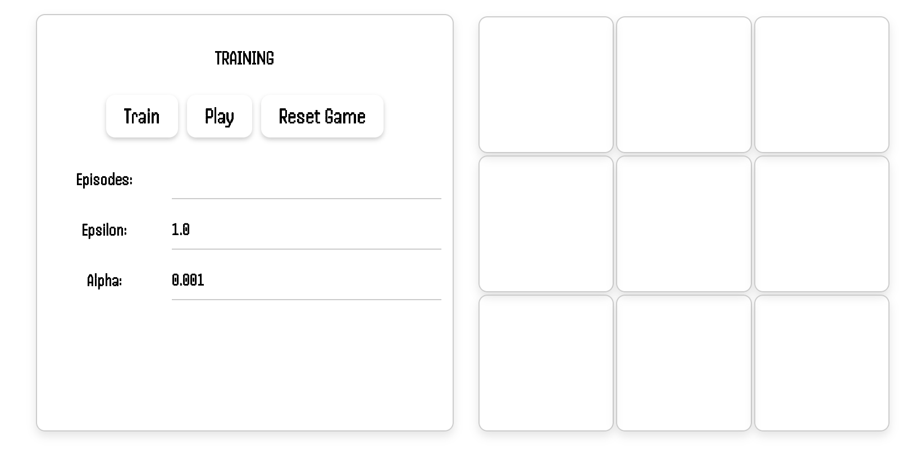
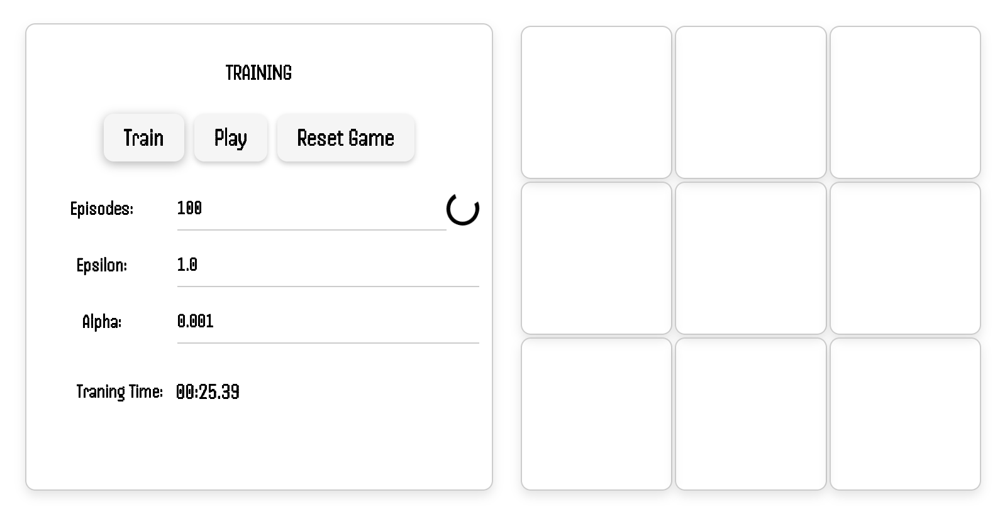
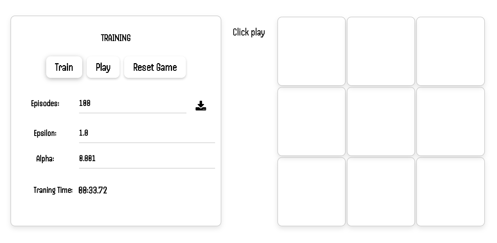
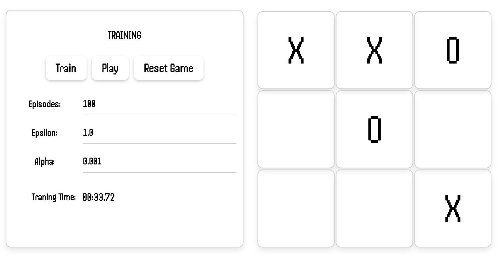

# TicTacToe-Q-Learner-Interactive
Discover the elegance of artificial intelligence as you navigate the dynamic dance between our Q-learning agent and human intuition. Watch in awe as the agent's evolution unfolds, shaping it into a nimble strategist that meticulously adjusts its tactics through iterative learning.

# Backend set-up 
* create virtual environment : `python -m venv env` 
* activate the virtual environement: `source ./env/Scripts/activate` (windows) or `. /env/bin/activate`(linux and macos)
* `pip install -r requirement.txt` (../BE/requirement)
* `python3 manager runserver` 

## Frontend set-up 
* `npm i`
* `ng serve` 

## Result 
### Before Training agent 

### During Training agent 

### After Training agent 

### Playing against trained agent

